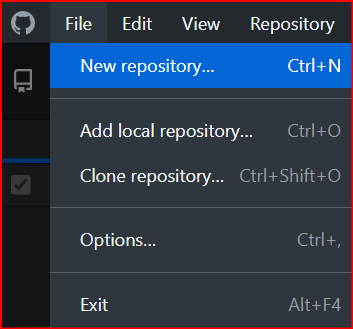
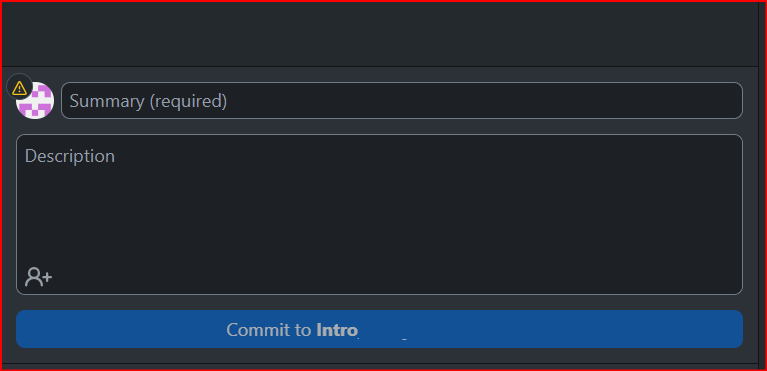
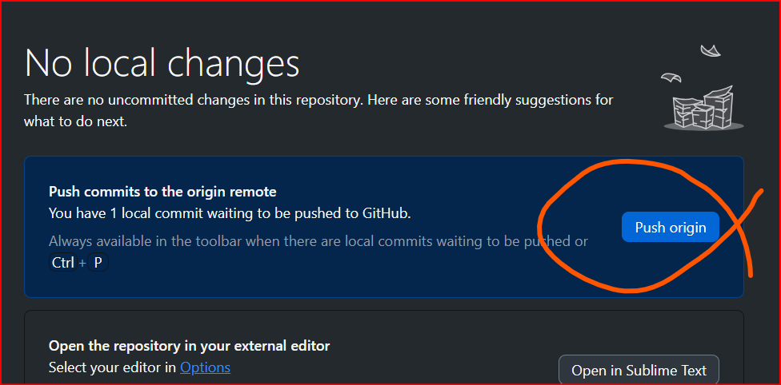

# Tutorial 4: GitHub For YOUR purposes
----------------------------------------------------------

## Overview
Git is a powerful version control tool that helps track changes to your data files over time. While Git is traditionally used for computer code, it can be just as effective for managing structured data by recording each change, allowing you to compare versions and collaborate efficiently. 

        
     
     Click above image to watch introductory video 

# 

## Learning Objectives
By the end of this lesson, you will be able to:
- Define FAIR data practices
- Understand the purpose of git tools
- Create a GitHub account
- Set up GitHub Desktop to track data files (Excel, CSV, etc.)
- Create your first repository
- Push data to GitHub (your first "commit")

## Prerequisites
None

-------------------------------------------

# FAIR Data principles

You may already have seen that the NIH requires researchers to share their data in ways that make it FAIR to maximize its value. Ensuring data is well-documented, openly available, and in standardized formats not only enhances transparency and collaboration but also aligns with NIH’s commitment to advancing scientific discovery.

The FAIR data principles are:

- Findable: Data should be assigned unique identifiers (e.g., DOIs) and be discoverable through metadata and search engines.
- Accessible: Data should be retrievable through standardized protocols, with clear terms on access (open or restricted).
- Interoperable: Data should use standardized formats and vocabularies to enable integration with other datasets.
- Reusable: Data should be well-documented with clear licensing to support reuse and replication in different contexts.

## Why Research Labs Need Version Control for Data? 
Research labs handle large datasets, evolving protocols, and multiple contributors over years. Without version control, it’s easy to:
- ❌ Lose track of previous datasets when files are updated.
- ❌ Overwrite important files when multiple people are working on them.
- ❌ Forget why a dataset changed, especially if students and researchers rotate over time.

How can GitHub Desktop helps with these challenges in data management
- Automatic version history for all data files.
- Clear tracking of protocol changes in README files.
- Collaboration with multiple researchers while preventing data loss.
- Integration with automated checks for data integrity (e.g., missing values in CSVs).

The key word: *AUTOMATICALLY* though we'll not get to THAT until the next tutorial.

Version control tools like Git provide a structured way to track, manage, and document changes to data over time, ensuring that every update, correction, or modification is properly recorded.

### Why Version Control for Research Data?
 1️⃣ Ensuring Data Integrity Over Time
 
Many research projects span years and generate large datasets.
Without version control, researchers might accidentally overwrite or lose critical data.
Git keeps a full history of changes, so you can always revert to a previous dataset if errors occur.
 2️⃣ Managing Changes in Protocols and Methods
 Research methodologies evolve over time—new equipment, updated software, or adjusted data collection techniques may be introduced.
 
If a dataset changes due to a new collection protocol, Git allows researchers to:
- Document protocol changes in commit messages.
- Compare "before and after" versions of the dataset.
- Maintain a clear audit trail of why and how data collection changed over time.
 
3️⃣ Tracking Contributions from Multiple Students and Researchers
 
Labs often have a rotating group of students and researchers working on different aspects of the same dataset.
Without version control, files may be duplicated, overwritten, or lost.

With Git, every change is linked to the individual who made it, making it easy to:
- Assign credit for contributions.
- Resolve conflicts between different updates.
- Prevent accidental data loss due to human error.

 
4️⃣ Supporting Automated Data Collection and Analysis Pipelines
 Many labs use automated sensors, scripts, or instruments that generate data continuously.
 Git can be integrated with data pipelines to:
- Automatically log changes when new data is added.
- Run data validation checks to detect anomalies.
- Ensure that analysis scripts always run on the correct version of the dataset.

 
5️⃣ Reproducibility and Compliance with FAIR Principles
- Scientific research relies on reproducibility—other researchers should be able to replicate results.
- Keeping a clear history of data versions, updates, and methodology changes ensures that future researchers can trust and understand the dataset.
- Many funding agencies and journals now require data provenance tracking, which Git provides naturally.

Now that we understand why research labs need version control, let's set up Git to support long-term data collection.

### Step 1: Creating a GitHub Account

Before you can start using GitHub for your materials, you need to create an account. GitHub is a platform that allows you to store, share, and collaborate on code. It is widely used by developers, students, and organizations for managing software projects using Git, a version control system that tracks changes in your code.

To get started, you need to sign up for a free GitHub account. This will give you access to your own profile, repositories, and collaboration tools. Follow the steps below to create your GitHub account.

- Go to GitHub's website
- Click on Sign up in the top-right corner.
- Enter your email address, username, and password.
- Click Create an account and follow the instructions.
- GitHub will send a verification email. Click the link in the email to verify your account.

## Step 2: Setting Up a GitHub Account & Installing GitHub Desktop

Before tracking your data, you need to install GitHub Desktop, a user-friendly application that simplifies version control without needing command-line commands.

### Instructions:

1. Go to [Github](https://desktop.github.com/download/) and download the desktop version for your operating system.
2. Install GitHub Desktop and sign in with your GitHub account.
3. Set up your GitHub profile with your name and email (important for tracking contributions) from the account you set up in step 1.

## Step 3: Creating a Repository for Your Research Data
A repository (A "repo") is like a folder where you store your research data and track changes over time.

### Instructions
1. Open GitHub Desktop and click “File” → “New Repository”.

2. Give your repository a name (e.g., "Climate_Data_Study_2024").
3. Choose a location **on your computer** where the repository will be stored.
4. Select Private (if you are using it for your lab group). You can name "collaborators" later (students, postdocs, etc)
5. Check “Initialize this repository with a README” (important for documenting your dataset). This is the appropriate spot to include summary information about this particular repository's purpose
6. Click Create Repository.

Now, you have a version-controlled folder on your computer where you can store and track your research data.

## Step 4: Adding Data Files to GitHub Desktop
Once your repository is set up, you can start adding data files like Excel, CSV, or JSON datasets. 

### Instructions:
1. Open your repository folder *on your computer.*
2. Copy or move your data files (e.g., temperature_data_2024.csv) into the folder.
3. Open GitHub Desktop, and you’ll see the new files listed as "Uncommitted Changes."
4. Add a commit message (e.g., "Initial dataset upload - July 2025").

5. Click the bottom "Commit to _____" button (this saves the version to your local repository).
6. Click Push to Origin (this uploads your data to GitHub.com).

**Why Commit Messages Matter?**
Every time you save changes in GitHub Desktop, you write a commit message explaining what changed. This helps future researchers understand:
- ✔ What was added/modified?
- ✔ Why was the data updated?
- ✔ Who made the change?

The previous commit is NOT overwritten. Rather, the beauty of git is that it saves what has changed. Thus, it is possible to revert to a previous commit (if something has gone wrong) or to specify a particular version of a data set for a publication.

## Step 5: Managing Protocol Changes & Dataset Updates
In research, data collection methods evolve. You might introduce:
- 🔹 New measurement instruments 📏
- 🔹 Revised calibration methods ⚙️
- 🔹 Updated sampling locations 🌍

Using GitHub Desktop, you can track protocol changes alongside your datasets.

### Instructions:
1. Open your repository folder.
2. Edit or add a new protocol document (e.g., data_collection_protocol_v2.docx).
3. Open GitHub Desktop, and you’ll see the updated file.
4. Write a commit message (e.g., "Updated protocol to include new sensor calibration process") as above for data
5. Click Commit to main, then Push to Origin.

Now, every protocol update is documented and timestamped, ensuring full transparency.

## Managing a lab group using the same git repository
It is rather unlikely that ONLY one person would be the involved in collecting all of the data for a research lab. In order to control and protect overwriting, Git provides clear management tools. That is covered in the next tutorial.

Go to the [next tutorial](Submodule_0_Tutorial_5_ManagingGit.md)